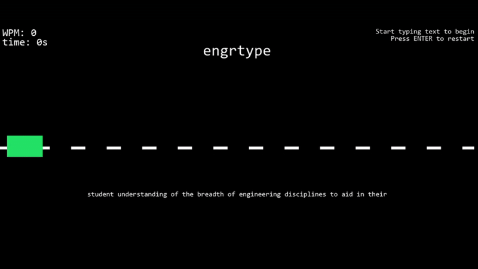

# engrtype

### a typing game created using pygame

final project for the engr 102 course, 'python computation'. implemented topics covered in the course such as dictionaries, method creation, and loops to create a fun, interactive game. used the class syllabus as a word bank. 
### results:

### improvements for the future:

miss/error counter

better graphics, even though i like the minimalist style
